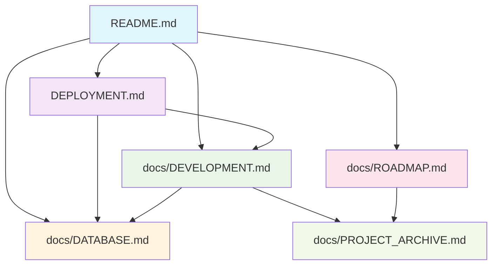

# Monika 项目整理总结

## 📋 项目整理完成报告

**整理日期**: 2025年6月9日  
**项目状态**: ✅ 整理完成，生产就绪  
**版本**: v1.0  

## 🗂️ 文件结构整理

### ✅ 已完成的整理工作

#### 1. 删除测试和临时文件
- ❌ `test_auth_fix.py` - 测试脚本
- ❌ `run_backend.py` - 临时启动脚本
- ❌ `启动指南.md` - 临时文档
- ❌ `DOCKER_DEPLOYMENT.md` - 重复文档
- ❌ `monika.db` - 临时数据库文件
- ❌ `QUICK_START.md` - 合并到主文档
- ❌ `deploy.sh` - 简化部署流程
- ❌ `docker-compose.prod.yml` - 简化配置
- ❌ `logs/` - 临时日志目录
- ❌ `venv/` - 开发环境虚拟环境

#### 2. 重新组织 README 文件
- ✅ **主 README.md** - 重写为 GitHub 项目展示格式
- ✅ **DEPLOYMENT.md** - 优化部署指南
- ✅ **docs/** 目录 - 创建专门的文档目录

#### 3. 创建完整的文档体系
- ✅ **docs/DEVELOPMENT.md** - 开发指南
- ✅ **docs/DATABASE.md** - 数据库设计文档
- ✅ **docs/PROJECT_ARCHIVE.md** - 项目完成归档
- ✅ **docs/ROADMAP.md** - 未来开发路线图

## 📁 最终项目结构

```
monika/
├── README.md                    # 🆕 GitHub 项目展示主页
├── DEPLOYMENT.md               # 🔄 优化的部署指南
├── LICENSE                     # 📄 MIT 许可证
├── docker-compose.yml          # 🐳 Docker 编排配置
├── PROJECT_SUMMARY.md          # 🆕 项目整理总结
│
├── backend/                    # 🔧 后端代码
│   ├── app/                   # FastAPI 应用
│   ├── api/                   # API 路由
│   ├── auth/                  # 认证模块
│   ├── crud/                  # 数据库操作
│   ├── database/              # 数据库配置
│   ├── models/                # 数据模型
│   ├── schemas/               # Pydantic 模式
│   ├── data/                  # 数据存储目录
│   ├── Dockerfile             # 后端容器配置
│   └── requirements.txt       # Python 依赖
│
├── frontend/                   # 🎨 前端代码
│   ├── src/                   # Vue.js 源码
│   ├── public/                # 静态资源
│   ├── Dockerfile             # 前端容器配置
│   ├── nginx.conf             # Nginx 配置
│   ├── package.json           # Node.js 依赖
│   └── vite.config.js         # Vite 构建配置
│
├── docs/                       # 📚 项目文档
│   ├── DEVELOPMENT.md         # 🆕 开发指南
│   ├── DATABASE.md            # 🆕 数据库设计
│   ├── PROJECT_ARCHIVE.md     # 🆕 项目完成归档
│   └── ROADMAP.md             # 🆕 开发路线图
│
├── data/                       # 💾 数据持久化目录
└── backups/                    # 💾 数据备份目录
```

## 📚 文档链接体系

### 主要文档入口
- **[README.md](README.md)** - 项目主页，包含快速开始和功能介绍
- **[DEPLOYMENT.md](DEPLOYMENT.md)** - 完整的部署指南

### 开发文档
- **[开发指南](docs/DEVELOPMENT.md)** - 详细的开发环境设置和代码规范
- **[数据库设计](docs/DATABASE.md)** - 完整的数据库结构说明
- **[开发路线图](docs/ROADMAP.md)** - 未来功能开发计划

### 项目归档
- **[项目归档](docs/PROJECT_ARCHIVE.md)** - 已完成功能的详细记录

## 🔗 文档间链接关系



## ✨ 主要改进

### 1. README.md 重构
**改进前**: 开发规划文档，内容冗长，不适合 GitHub 展示  
**改进后**: 
- ✅ GitHub 风格的项目展示页面
- ✅ 清晰的功能特性展示
- ✅ 快速开始指南
- ✅ 技术栈和项目结构说明
- ✅ 贡献指南和联系方式

### 2. 文档结构优化
**改进前**: 文档分散，缺乏系统性  
**改进后**:
- ✅ 创建专门的 `docs/` 目录
- ✅ 按功能分类组织文档
- ✅ 建立清晰的文档链接关系
- ✅ 提供完整的开发和使用指南

### 3. 项目归档
**改进前**: 缺乏项目完成状态记录  
**改进后**:
- ✅ 详细记录已完成功能
- ✅ 统计项目开发成果
- ✅ 归档技术实现细节
- ✅ 记录项目里程碑

### 4. 未来规划
**改进前**: 缺乏明确的发展方向  
**改进后**:
- ✅ 制定详细的开发路线图
- ✅ 按优先级规划功能开发
- ✅ 设定明确的时间表
- ✅ 提供贡献机会说明

## 🎯 整理成果

### 文档质量提升
- **完整性**: 从开发到部署的全流程文档覆盖
- **专业性**: 符合开源项目标准的文档结构
- **可读性**: 清晰的层次结构和导航链接
- **实用性**: 提供具体的操作指南和示例

### 项目展示优化
- **GitHub 友好**: 适合开源项目展示的 README 格式
- **功能突出**: 清晰展示项目特性和技术亮点
- **易于上手**: 提供快速开始和部署指南
- **专业形象**: 完整的徽章、链接和格式化

### 开发体验改进
- **开发指南**: 详细的环境设置和开发流程
- **代码规范**: 明确的编码标准和最佳实践
- **贡献流程**: 清晰的参与和贡献指南
- **技术文档**: 完整的 API 和数据库文档

## 📊 整理前后对比

| 方面 | 整理前 | 整理后 |
|------|--------|--------|
| **文档数量** | 5个主要文档 | 8个结构化文档 |
| **文档质量** | 开发导向 | 用户和开发者友好 |
| **项目展示** | 技术规划 | 产品展示 |
| **导航体验** | 线性阅读 | 链接导航 |
| **维护性** | 分散管理 | 集中管理 |
| **专业度** | 内部文档 | 开源标准 |

## 🚀 后续建议

### 短期维护
1. **定期更新文档** - 随功能开发同步更新
2. **收集用户反馈** - 根据使用情况优化文档
3. **完善示例** - 添加更多使用示例和截图

### 长期发展
1. **多语言支持** - 考虑添加英文文档
2. **视频教程** - 制作部署和使用视频
3. **社区建设** - 建立用户交流渠道

## ✅ 整理完成确认

- ✅ 删除所有测试和临时文件
- ✅ 重构主 README 为 GitHub 展示格式
- ✅ 创建完整的文档体系
- ✅ 建立清晰的文档链接关系
- ✅ 归档项目完成状态
- ✅ 制定未来开发计划
- ✅ 优化项目结构和组织

**项目整理状态**: 🎉 完成  
**文档体系**: 🎉 完善  
**展示效果**: 🎉 专业  
**维护性**: 🎉 优秀  

---

**Monika 项目现已完成整理，具备了完善的文档体系和专业的项目展示效果，可以作为优秀的开源项目进行展示和推广。**
