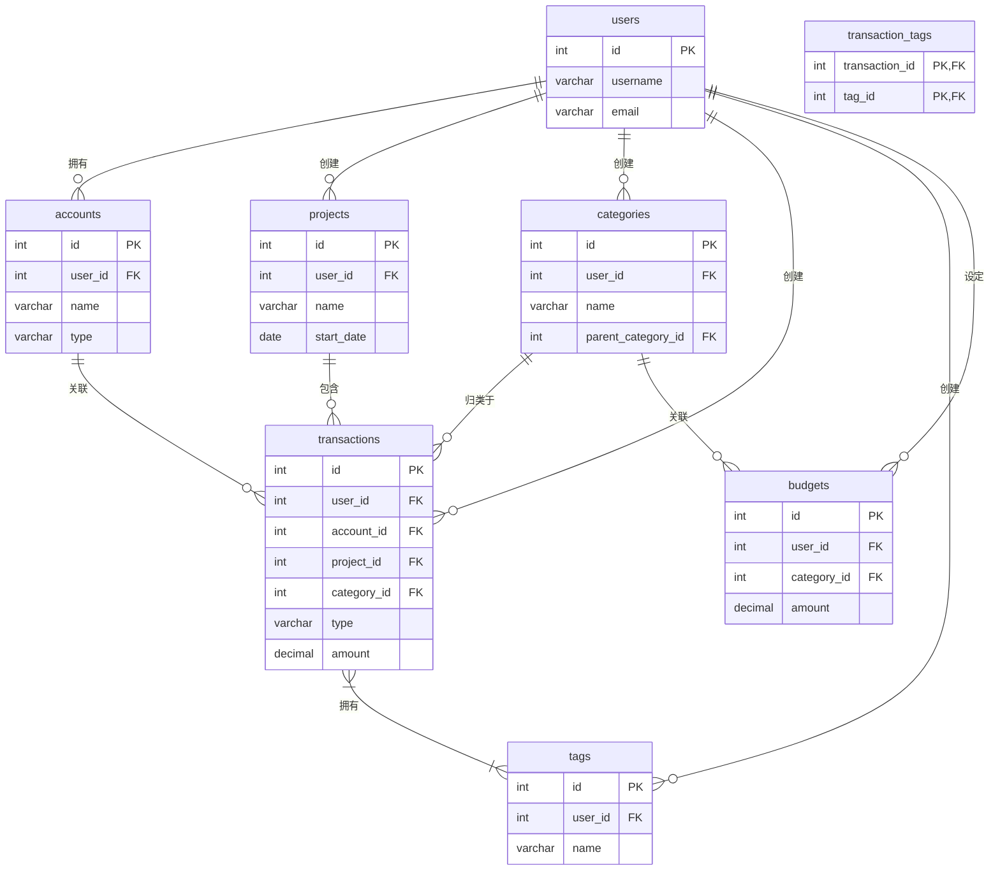

# Monika - 个人记账软件完整开发规划

**版本**: 1.0
**日期**: 2025年6月8日
**状态**: 开发规划阶段

---

## 1. 项目概述

**Monika** 是一个基于 Web 的个人记账软件，旨在为用户提供一个轻量、高效且功能强大的财务管理工具。项目采用前后端分离的现代化架构，注重异步性能、数据安全和用户体验。

---

## 2. 技术栈

- **后端**: **FastAPI**
  - *选型理由*: 基于 Python 3.7+ 的类型提示，提供高性能的异步 API。自动生成交互式文档（Swagger UI），极大方便了前后端联调。轻量级框架，非常适合本项目。
- **前端**: **Vue.js**
  - *选型理由*: 渐进式框架，上手快，生态丰富。其响应式数据绑定和组件化系统非常适合构建数据驱动的单页面应用（SPA）。
- **数据库**: **SQLite**
  - *选型理由*: 轻量级、无服务器的文件型数据库，零配置，非常适合个人项目或应用的初始开发阶段。可以无缝地嵌入到 FastAPI 应用中。

---

## 3. 核心业务功能

- **身份认证**: 提供安全的用户注册和登录系统。
- **账务管理**: 以“账务项目”和“账务条目”两个层级，结构化地管理所有财务记录。
- **分类与标签**: 提供固定分类和灵活标签两种体系，满足不同的统计和查询需求。
- **预算管理**: 允许用户设定预算，并追踪执行情况。
- **仪表盘与分析**: 通过可视化的图表和数据摘要，帮助用户洞察其财务状况。

---

## 4. 功能详细规划

### 4.1. 身份认证 (Authentication)

- **功能描述**:
  1.  **注册**: 用户可以使用邮箱和密码创建新账户。
  2.  **登录**: 用户通过邮箱和密码登录，系统返回认证 Token (如 JWT) 用于后续请求。
  3.  **忘记密码**: 提供一个入口，为未来实现密码重置功能预留空间。
- **关联数据库表**:
  - 所有用户数据存储在 `users` 表中。

### 4.2. 核心账务管理

#### 4.2.1. 账务项目 (Projects)

- **功能描述**:
  - "账务项目"是一个聚合单位，用于管理一组相关的账务条目。例如：“2025年春节旅行”、“房屋装修”等。
  - 用户可以对项目进行增、删、改、查操作。
  - 在主界面上，以项目的形式展示宏观的财务状况，并可展开查看其包含的详细条目。
- **关联数据库表**:
  - 新建 `projects` 表来存储项目信息。
  - 在 `transactions` 表中添加 `project_id` 外键进行关联。

#### 4.2.2. 账务条目 (Transactions)

- **功能描述**:
  - “账务条目”是系统中最小的记账单位，记录单笔收入或支出。
  - 用户可以对条目进行增、删、改、查操作。
  - 每条条目都必须关联一个**资金账户**和一个**分类**。
- **关联数据库表**:
  - `transactions` 表是系统的核心，存储所有条目细节。

### 4.3. 仪表盘与数据分析 (Dashboard)

- **功能描述**:
  1.  **时间范围筛选**: 用户可以按天、周、月、季度、年等维度筛选数据。
  2.  **数据总览**: 实时计算并显示指定时间范围内的总支出、总收入和净收入。
  3.  **异常支出提醒**: 通过算法分析，高亮显示指定时间范围内，与用户消费习惯相比支出异常的条目或分类。
      - *实现思路*: 计算某个分类在过去N个周期内的平均支出，若当前周期支出远超平均值（例如，超过2个标准差），则标记为异常。
  4.  **数据可视化**: 使用图表（如饼图、折线图）展示分类支出占比、收支趋势等信息。
- **关联数据库表**:
  - 主要依赖 `transactions` 表的 `amount`, `type`, `transaction_date` 字段进行计算。
  - `categories` 表为数据聚合和分析提供维度。

---

## 5. 数据库设计详细指南

本节完整定义了项目所需的所有数据表结构。

### 5.1. 实体关系图 (ERD)

### 5.2. 表格结构定义

#### `users` - 用户表
| 字段名 | 数据类型 | 约束 | 说明 |
| :--- | :--- | :--- | :--- |
| `id` | `INTEGER` | `PRIMARY KEY AUTOINCREMENT` | 用户唯一标识符 |
| `username` | `VARCHAR(50)` | `UNIQUE`, `NOT NULL` | 用户名 |
| `email` | `VARCHAR(100)`| `UNIQUE`, `NOT NULL` | 邮箱 |
| `password_hash`| `VARCHAR(255)`| `NOT NULL` | 加密后的用户密码 |
| `default_currency`| `VARCHAR(3)` | `NOT NULL`, `DEFAULT 'CNY'` | 默认货币 |
| `created_at` | `TIMESTAMP` | `NOT NULL`, `DEFAULT CURRENT_TIMESTAMP` | 账户创建时间 |

#### `accounts` - 资金账户表
| 字段名 | 数据类型 | 约束 | 说明 |
| :--- | :--- | :--- | :--- |
| `id` | `INTEGER` | `PRIMARY KEY AUTOINCREMENT` | 账户唯一标识符 |
| `user_id` | `INTEGER` | `NOT NULL`, `FOREIGN KEY` (references `users.id`) | 关联的用户 |
| `name` | `VARCHAR(100)`| `NOT NULL` | 账户名称 (e.g., "招行储蓄卡") |
| `type` | `VARCHAR(20)` | `NOT NULL` | 账户类型 (e.g., 'debit_card') |
| `initial_balance`| `DECIMAL(10, 2)`| `NOT NULL`, `DEFAULT 0.00` | 初始余额 |
| `is_active` | `BOOLEAN` | `NOT NULL`, `DEFAULT 1` | 账户是否仍在使用中 |

#### **`projects` - 账务项目表 (新增)**
| 字段名 | 数据类型 | 约束 | 说明 |
| :--- | :--- | :--- | :--- |
| `id` | `INTEGER` | `PRIMARY KEY AUTOINCREMENT` | 项目唯一标识符 |
| `user_id` | `INTEGER` | `NOT NULL`, `FOREIGN KEY` (references `users.id`) | 关联的用户 |
| `name` | `VARCHAR(100)`| `NOT NULL` | 项目名称 (e.g., "2025春节旅行") |
| `description`| `TEXT` | | 项目的详细描述 |
| `start_date`| `DATE` | | 项目开始日期 |
| `end_date`| `DATE` | | 项目结束日期 |

#### `categories` - 分类表
| 字段名 | 数据类型 | 约束 | 说明 |
| :--- | :--- | :--- | :--- |
| `id` | `INTEGER` | `PRIMARY KEY AUTOINCREMENT` | 分类唯一标识符 |
| `user_id` | `INTEGER` | `FOREIGN KEY` (references `users.id`) | 关联的用户 (NULL为系统预设) |
| `parent_category_id` | `INTEGER` | `FOREIGN KEY` (references `categories.id`) | 父分类ID，实现多级分类 |
| `name` | `VARCHAR(50)` | `NOT NULL` | 分类名称 (e.g., "餐饮") |
| `type` | `VARCHAR(10)` | `NOT NULL` | 'income' 或 'expense' |
| `icon_name` | `VARCHAR(50)` | | 用于UI显示的图标名称 |

#### `transactions` - 核心交易表
| 字段名 | 数据类型 | 约束 | 说明 |
| :--- | :--- | :--- | :--- |
| `id` | `INTEGER` | `PRIMARY KEY AUTOINCREMENT` | 交易唯一标识符 |
| `user_id` | `INTEGER` | `NOT NULL`, `FOREIGN KEY` (references `users.id`) | 关联的用户 |
| `account_id` | `INTEGER` | `NOT NULL`, `FOREIGN KEY` (references `accounts.id`) | 使用的资金账户 |
| `project_id`| `INTEGER` | `FOREIGN KEY` (references `projects.id`) | **(新增)** 归属的账务项目 |
| `category_id` | `INTEGER` | `FOREIGN KEY` (references `categories.id`) | 归属的分类 |
| `type` | `VARCHAR(10)` | `NOT NULL` | 'income' (收入) 或 'expense' (支出) |
| `title` | `VARCHAR(255)`| | 交易摘要 (可选) |
| `amount` | `DECIMAL(10, 2)`| `NOT NULL`, `CHECK (amount >= 0)` | **金额 (总是正数)** |
| `currency` | `VARCHAR(3)` | `NOT NULL` | 货币类型 (e.g., 'CNY') |
| `transaction_date`| `TIMESTAMP` | `NOT NULL` | **业务发生时间** |
| `notes` | `TEXT` | | 详细备注 |
| `created_at` | `TIMESTAMP` | `NOT NULL`, `DEFAULT CURRENT_TIMESTAMP` | **记录创建时间** |

#### `tags` 和 `transaction_tags` - 标签体系
**`tags` 表**
| 字段名 | 数据类型 | 约束 | 说明 |
| :--- | :--- | :--- | :--- |
| `id` | `INTEGER` | `PRIMARY KEY AUTOINCREMENT` | 标签唯一标识符 |
| `user_id` | `INTEGER` | `NOT NULL`, `FOREIGN KEY` (references `users.id`) | 关联的用户 |
| `name` | `VARCHAR(50)` | `NOT NULL` | 标签名称 |

**`transaction_tags` (连接表)**
| 字段名 | 数据类型 | 约束 | 说明 |
| :--- | :--- | :--- | :--- |
| `transaction_id` | `INTEGER` | `PRIMARY KEY`, `FOREIGN KEY` | 关联的交易 |
| `tag_id` | `INTEGER` | `PRIMARY KEY`, `FOREIGN KEY` | 关联的标签 |

#### `budgets` - 预算表
| 字段名 | 数据类型 | 约束 | 说明 |
| :--- | :--- | :--- | :--- |
| `id` | `INTEGER` | `PRIMARY KEY AUTOINCREMENT` | 预算唯一标识符 |
| `user_id` | `INTEGER` | `NOT NULL`, `FOREIGN KEY` (references `users.id`) | 关联的用户 |
| `category_id` | `INTEGER` | `FOREIGN KEY` (references `categories.id`) | 预算针对的分类 (NULL为总预算) |
| `amount` | `DECIMAL(10, 2)`| `NOT NULL` | 预算金额 |
| `period` | `VARCHAR(20)` | `NOT NULL` | 预算周期 (e.g., 'monthly') |
| `start_date`| `DATE` | `NOT NULL` | 预算周期开始日期 |

---

## 6. 开发注意事项

1.  **SQLite 外键支持**: 在 FastAPI 应用中，数据库连接建立后，必须先执行 `PRAGMA foreign_keys = ON;` 来启用外键约束。建议在数据库连接的依赖项中处理。
2.  **API 设计**: 遵循 RESTful 风格设计 API 端点，保持接口的清晰和一致性。
3.  **密码安全**: 绝对不能明文存储密码。使用 `passlib` 等库对用户密码进行哈希加盐处理。
4.  **开发顺序建议**:
    1.  **阶段一 (核心后端)**: 搭建 FastAPI 项目，实现用户认证 (`users` 表)，完成 `accounts`, `categories`, `transactions` 表的 CRUD 接口。
    2.  **阶段二 (核心前端)**: 搭建 Vue 项目，完成登录、注册页面，实现核心的记账流水显示和添加功能。
    3.  **阶段三 (功能完善)**: 依次实现“账务项目”、“预算”、“标签”等功能，前后端同步进行。
    4.  **阶段四 (数据分析)**: 开发仪表盘页面，对接后端分析接口，完成数据可视化。

