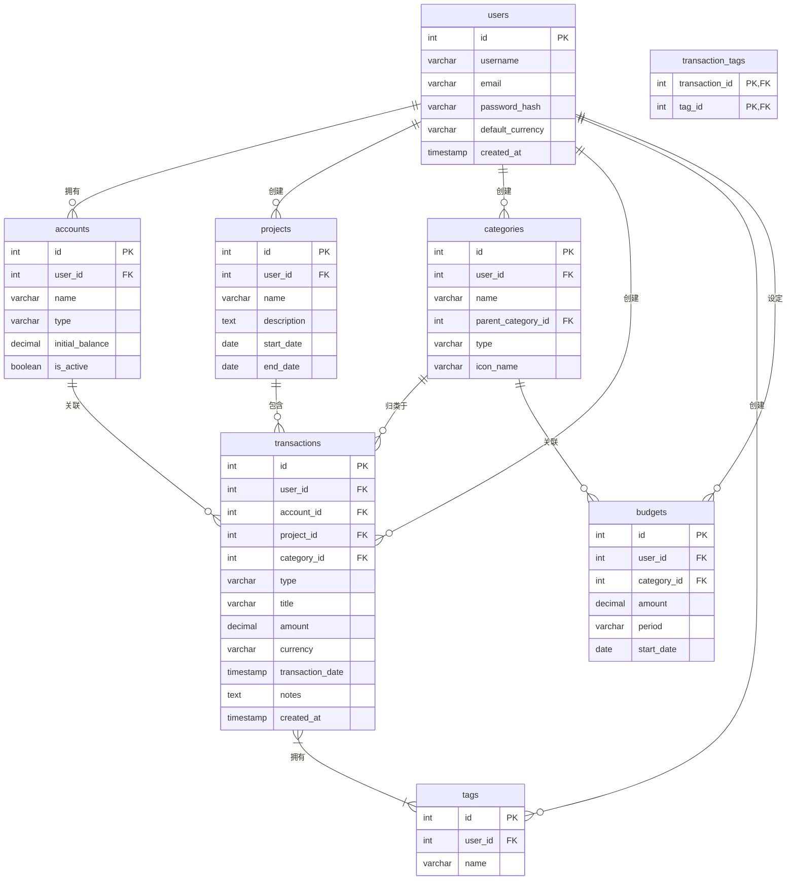

# Monika 数据库设计

## 📊 数据库概述

Monika 使用 SQLite 作为数据库，通过 SQLAlchemy ORM 进行数据操作。数据库设计采用关系型模型，支持用户多租户、项目分组和灵活的分类系统。

## 🗂️ 实体关系图 (ERD)



## 📋 表结构详细说明

### users - 用户表

用户基础信息表，支持多用户系统。

| 字段名 | 数据类型 | 约束 | 说明 |
|--------|----------|------|------|
| `id` | `INTEGER` | `PRIMARY KEY AUTOINCREMENT` | 用户唯一标识符 |
| `username` | `VARCHAR(50)` | `UNIQUE`, `NOT NULL` | 用户名 |
| `email` | `VARCHAR(100)` | `UNIQUE`, `NOT NULL` | 邮箱地址 |
| `password_hash` | `VARCHAR(255)` | `NOT NULL` | 加密后的密码 |
| `default_currency` | `VARCHAR(3)` | `NOT NULL`, `DEFAULT 'CNY'` | 默认货币 |
| `created_at` | `TIMESTAMP` | `NOT NULL`, `DEFAULT CURRENT_TIMESTAMP` | 创建时间 |

**索引：**
- `idx_users_username` ON `username`
- `idx_users_email` ON `email`

### accounts - 资金账户表

管理用户的各种资金账户（银行卡、现金、投资账户等）。

| 字段名 | 数据类型 | 约束 | 说明 |
|--------|----------|------|------|
| `id` | `INTEGER` | `PRIMARY KEY AUTOINCREMENT` | 账户唯一标识符 |
| `user_id` | `INTEGER` | `NOT NULL`, `FOREIGN KEY` | 关联用户ID |
| `name` | `VARCHAR(100)` | `NOT NULL` | 账户名称 |
| `type` | `VARCHAR(20)` | `NOT NULL` | 账户类型 |
| `initial_balance` | `DECIMAL(10, 2)` | `NOT NULL`, `DEFAULT 0.00` | 初始余额 |
| `is_active` | `BOOLEAN` | `NOT NULL`, `DEFAULT 1` | 是否激活 |

**账户类型枚举：**
- `debit_card` - 储蓄卡
- `credit_card` - 信用卡
- `cash` - 现金
- `investment` - 投资账户
- `other` - 其他

**索引：**
- `idx_accounts_user_id` ON `user_id`

### projects - 项目表

项目管理功能，用于按项目分组管理交易记录。

| 字段名 | 数据类型 | 约束 | 说明 |
|--------|----------|------|------|
| `id` | `INTEGER` | `PRIMARY KEY AUTOINCREMENT` | 项目唯一标识符 |
| `user_id` | `INTEGER` | `NOT NULL`, `FOREIGN KEY` | 关联用户ID |
| `name` | `VARCHAR(100)` | `NOT NULL` | 项目名称 |
| `description` | `TEXT` | | 项目描述 |
| `start_date` | `DATE` | | 项目开始日期 |
| `end_date` | `DATE` | | 项目结束日期 |

**索引：**
- `idx_projects_user_id` ON `user_id`

### categories - 分类表

收入和支出的分类管理，支持多级分类。

| 字段名 | 数据类型 | 约束 | 说明 |
|--------|----------|------|------|
| `id` | `INTEGER` | `PRIMARY KEY AUTOINCREMENT` | 分类唯一标识符 |
| `user_id` | `INTEGER` | `FOREIGN KEY` | 关联用户ID（NULL为系统预设） |
| `parent_category_id` | `INTEGER` | `FOREIGN KEY` | 父分类ID |
| `name` | `VARCHAR(50)` | `NOT NULL` | 分类名称 |
| `type` | `VARCHAR(10)` | `NOT NULL` | 分类类型 |
| `icon_name` | `VARCHAR(50)` | | 图标名称 |

**分类类型：**
- `income` - 收入
- `expense` - 支出

**索引：**
- `idx_categories_user_id` ON `user_id`
- `idx_categories_type` ON `type`

### transactions - 交易记录表

核心交易数据表，记录所有收支信息。

| 字段名 | 数据类型 | 约束 | 说明 |
|--------|----------|------|------|
| `id` | `INTEGER` | `PRIMARY KEY AUTOINCREMENT` | 交易唯一标识符 |
| `user_id` | `INTEGER` | `NOT NULL`, `FOREIGN KEY` | 关联用户ID |
| `account_id` | `INTEGER` | `NOT NULL`, `FOREIGN KEY` | 关联账户ID |
| `project_id` | `INTEGER` | `FOREIGN KEY` | 关联项目ID |
| `category_id` | `INTEGER` | `FOREIGN KEY` | 关联分类ID |
| `type` | `VARCHAR(10)` | `NOT NULL` | 交易类型 |
| `title` | `VARCHAR(255)` | | 交易标题 |
| `amount` | `DECIMAL(10, 2)` | `NOT NULL`, `CHECK (amount >= 0)` | 交易金额 |
| `currency` | `VARCHAR(3)` | `NOT NULL` | 货币类型 |
| `transaction_date` | `TIMESTAMP` | `NOT NULL` | 交易日期 |
| `notes` | `TEXT` | | 备注信息 |
| `created_at` | `TIMESTAMP` | `NOT NULL`, `DEFAULT CURRENT_TIMESTAMP` | 创建时间 |

**交易类型：**
- `income` - 收入
- `expense` - 支出

**索引：**
- `idx_transactions_user_id` ON `user_id`
- `idx_transactions_account_id` ON `account_id`
- `idx_transactions_project_id` ON `project_id`
- `idx_transactions_category_id` ON `category_id`
- `idx_transactions_date` ON `transaction_date`
- `idx_transactions_type` ON `type`

### tags - 标签表

灵活的标签系统，用于交易记录的多维度标记。

| 字段名 | 数据类型 | 约束 | 说明 |
|--------|----------|------|------|
| `id` | `INTEGER` | `PRIMARY KEY AUTOINCREMENT` | 标签唯一标识符 |
| `user_id` | `INTEGER` | `NOT NULL`, `FOREIGN KEY` | 关联用户ID |
| `name` | `VARCHAR(50)` | `NOT NULL` | 标签名称 |

**索引：**
- `idx_tags_user_id` ON `user_id`

### transaction_tags - 交易标签关联表

多对多关系表，关联交易记录和标签。

| 字段名 | 数据类型 | 约束 | 说明 |
|--------|----------|------|------|
| `transaction_id` | `INTEGER` | `PRIMARY KEY`, `FOREIGN KEY` | 交易ID |
| `tag_id` | `INTEGER` | `PRIMARY KEY`, `FOREIGN KEY` | 标签ID |

### budgets - 预算表

预算管理功能，支持按分类设置预算。

| 字段名 | 数据类型 | 约束 | 说明 |
|--------|----------|------|------|
| `id` | `INTEGER` | `PRIMARY KEY AUTOINCREMENT` | 预算唯一标识符 |
| `user_id` | `INTEGER` | `NOT NULL`, `FOREIGN KEY` | 关联用户ID |
| `category_id` | `INTEGER` | `FOREIGN KEY` | 关联分类ID |
| `amount` | `DECIMAL(10, 2)` | `NOT NULL` | 预算金额 |
| `period` | `VARCHAR(20)` | `NOT NULL` | 预算周期 |
| `start_date` | `DATE` | `NOT NULL` | 开始日期 |

**预算周期：**
- `daily` - 日预算
- `weekly` - 周预算
- `monthly` - 月预算
- `yearly` - 年预算

**索引：**
- `idx_budgets_user_id` ON `user_id`
- `idx_budgets_category_id` ON `category_id`

## 🔧 数据库配置

### SQLite 配置

```python
# database/database.py
SQLALCHEMY_DATABASE_URL = "sqlite:///./data/monika.db"

engine = create_engine(
    SQLALCHEMY_DATABASE_URL,
    connect_args={"check_same_thread": False}
)
```

### 外键约束

SQLite 默认不启用外键约束，需要手动开启：

```python
@event.listens_for(Engine, "connect")
def set_sqlite_pragma(dbapi_connection, connection_record):
    cursor = dbapi_connection.cursor()
    cursor.execute("PRAGMA foreign_keys=ON")
    cursor.close()
```

## 📈 性能优化

### 查询优化

1. **合理使用索引**：在经常查询的字段上建立索引
2. **分页查询**：大数据量时使用 LIMIT 和 OFFSET
3. **预加载关联**：使用 `joinedload` 减少 N+1 查询

### 数据备份

```bash
# 备份数据库
cp data/monika.db backups/monika-backup-$(date +%Y%m%d-%H%M%S).db

# 使用 Docker 备份
docker compose --profile backup run --rm db-backup
```

## 🔄 数据迁移

### 未来迁移计划

当需要更复杂的数据库迁移时，建议使用 Alembic：

```bash
# 安装 Alembic
pip install alembic

# 初始化迁移环境
alembic init alembic

# 生成迁移文件
alembic revision --autogenerate -m "Add new table"

# 执行迁移
alembic upgrade head
```

## 📊 数据分析查询示例

### 常用统计查询

```sql
-- 用户月度收支统计
SELECT 
    DATE_FORMAT(transaction_date, '%Y-%m') as month,
    type,
    SUM(amount) as total
FROM transactions 
WHERE user_id = ? 
GROUP BY month, type;

-- 分类支出排行
SELECT 
    c.name,
    SUM(t.amount) as total
FROM transactions t
JOIN categories c ON t.category_id = c.id
WHERE t.user_id = ? AND t.type = 'expense'
GROUP BY c.id
ORDER BY total DESC;
```
